

  
      

# YouAchieve

Мобильное приложение под Android для управления проектами. 
В приложении можно просматривать, создавать и редактировать, рабочие пространства, 
проекты и задачи, а также отмечать выполнение задач напрямую из списка задач.

> [!NOTE]
> Этот проект – всего лишь попытка сделать нечто большое.
> Тут осталось ещё много работы, но кто её будет делать?
> Впрочем, это уже совсем другая история.

## Используемые технологии

- Язык программирования: **Kotlin**;
- **Clean Architecture** с применением паттерна **MVVM**;
- **Dependency Injection** с применением фреймворка **Dagger 2**;
- База данных: **SQLite** (библиотека **Room**);
- **RecyclerView** для работы со списками;
- **Kotlin Coroutines** для асинхронной работы с данными.

## Экраны приложения

1. Навигационное меню
2. Рабочее пространство
   1. Проекты
   2. Задачи
   3. Участники
   4. Действия
3. Создание рабочего пространства
4. Создание рабочего проекта
5. Создание задачи
6. Редактирование рабочего пространства
7. Редактирование рабочего проекта
8. Редактирование задачи

## Дизайн приложения

Общий план дизайна окон приложения:

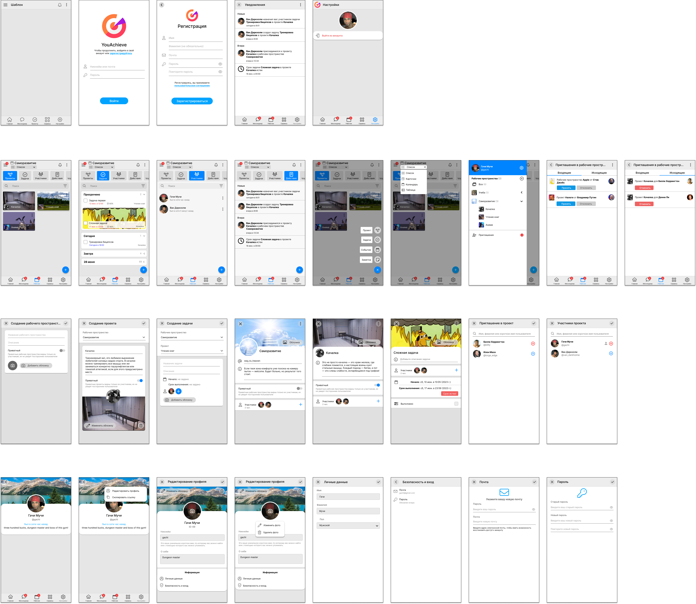

 

<b>Детальный разбор окон приложения</b>

Дизайн окон авторизации и регистрации:

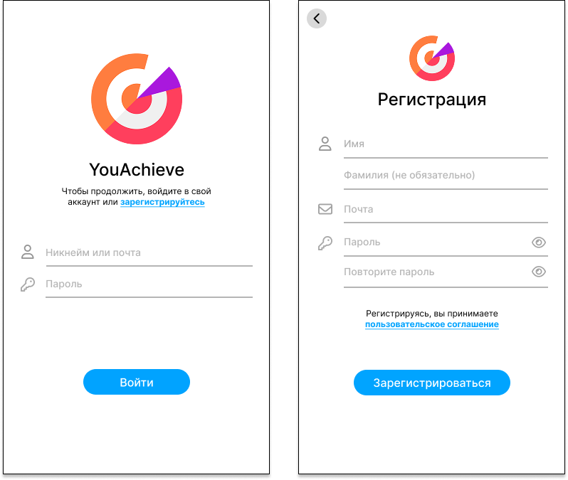

Дизайн разделов рабочего пространства: проекты, задачи, участники.

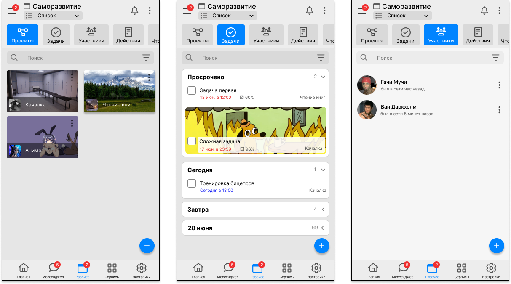

Дизайн раздела действий рабочего пространства и выпадающих меню:

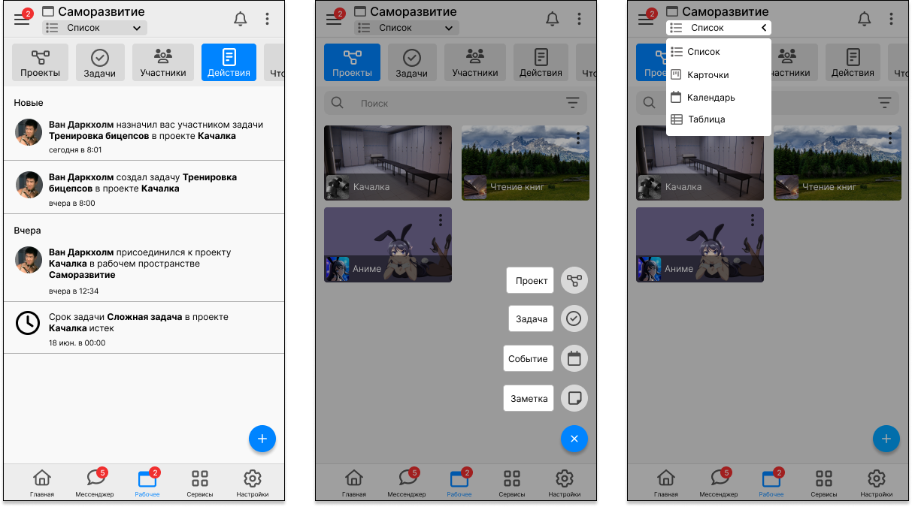

Дизайн навигационного меню и окна приглашений в рабочее пространство:

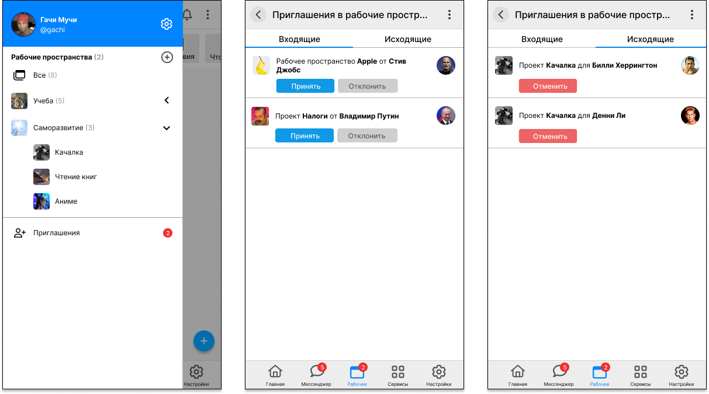

Дизайн окон создания рабочего пространства, проекта и задачи:

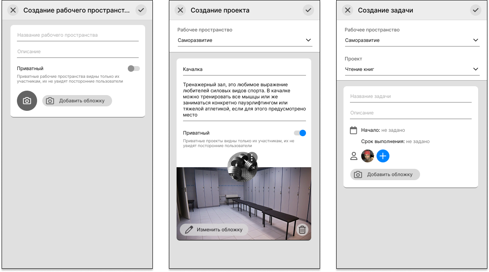

Дизайн окон редактирования рабочего пространства, проекта и задачи:

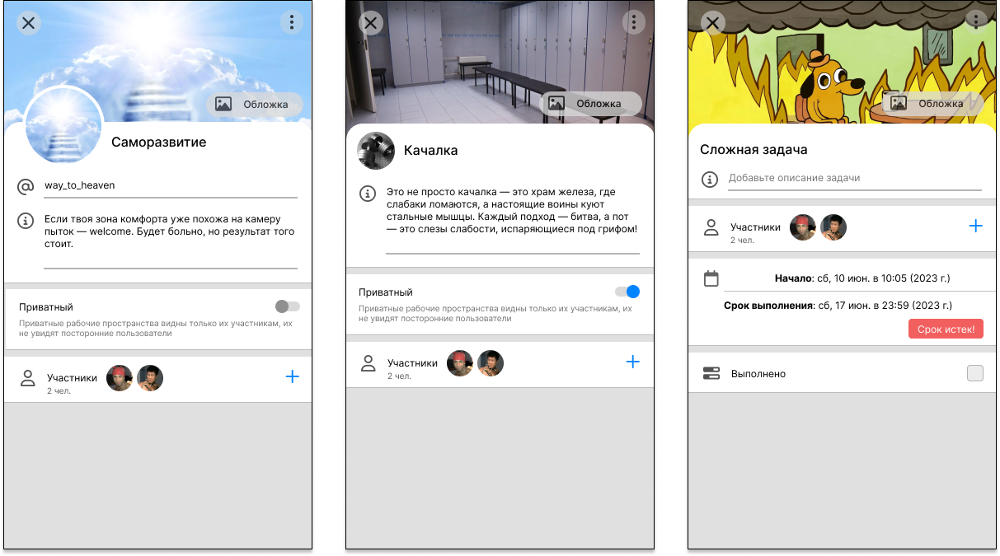

Дизайн окон приглашения в рабочее пространство / проект:

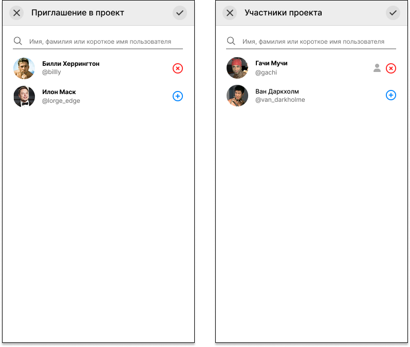

Дизайн окна страницы пользователя и её редактирования:

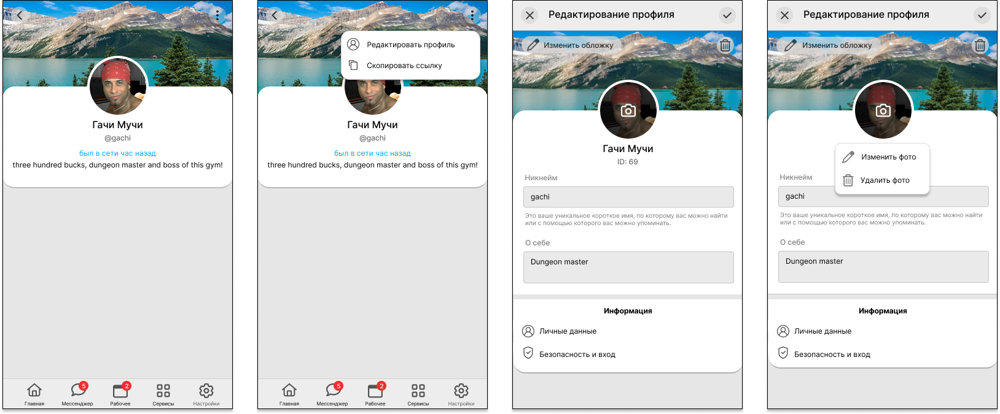

Дизайн окон настроек пользователя:

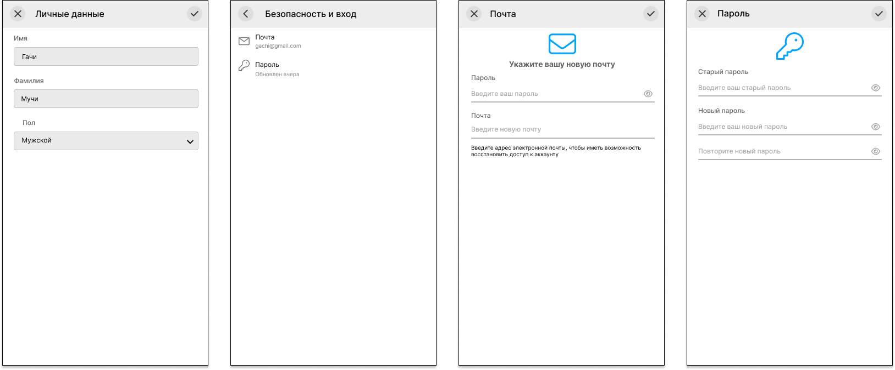

Дизайн окон уведомлений пользователя и настроек приложения:

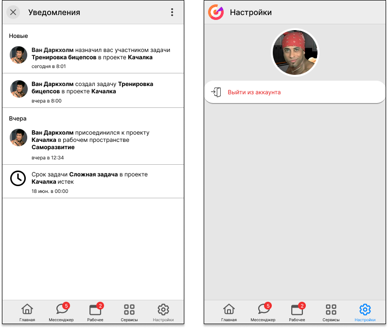

 

> [!WARNING]
> В приложении реализована малая часть из того, что представлена на макете с дизайном приложения.
> Макет с дизайном отражает лишь мое видение как должно было получиться.

## Архитектура приложения

При проектировании приложения был использован подход Clean Architecture.

<picture>
   <source media="(prefers-color-scheme: dark)" srcset="./assets/images/architecture-dark.png">
   <source media="(prefers-color-scheme: light)" srcset="./assets/images/architecture-light.png">
   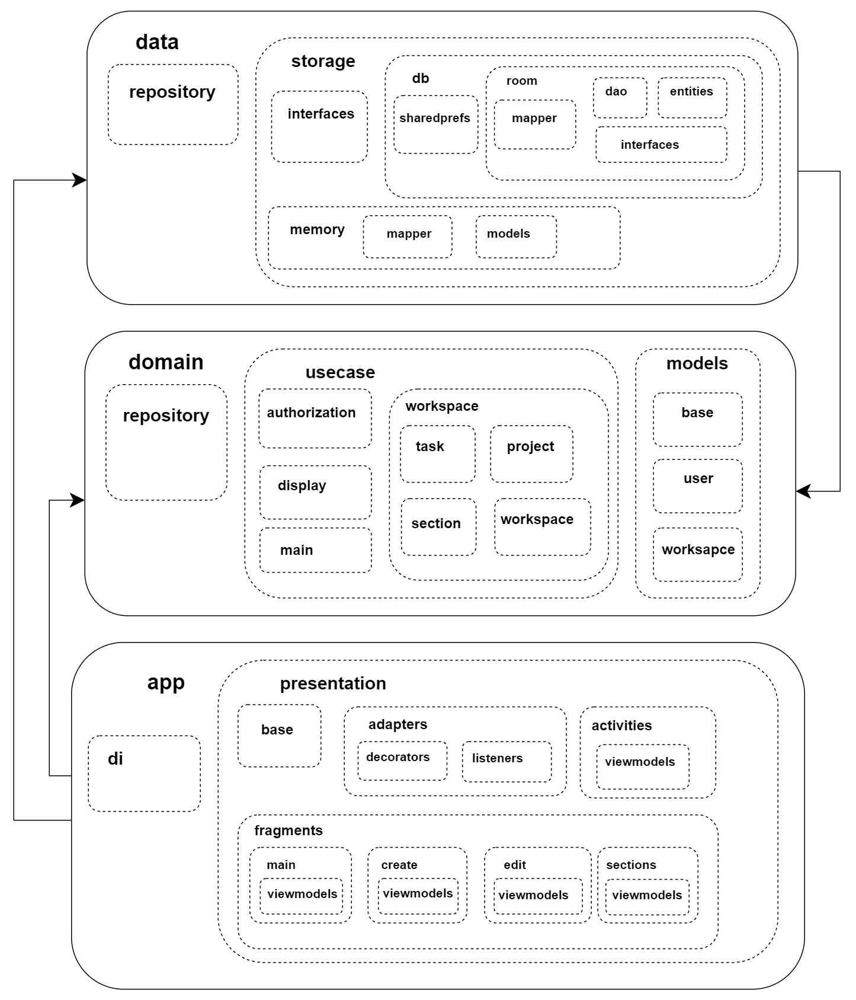
</picture>

 

<b>Подробное описание слоёв Clean Architecture</b>

1. **Представление (Presentation Layer).**  Этот слой отвечает за отображение данных пользователю и обработку пользовательского ввода. Он содержит элементы интерфейса пользователя (`Activity`, `Fragment`) и презентеры (`Presenter`), которые отвечают за взаимодействие с остальными слоями. 

   1. **Базовые классы (base).** В этом компоненте находятся базовые классы, реализующие основную логику, которая используется во многих других классах `Activity`, Fragment или `ViewModel`.

   2. **Адаптеры (adapters).** В этом компоненте находятся адаптеры для списков. Адаптер – это мост между набором данных и объектом, использующим эти данные. Также адаптер отвечает за создание View-компонента для каждой единицы данных из набора.

      1. **Декораторы (base).** В этом компоненте находятся декораторы – классы, позволяющие декорировать каждый отдельный элемент списка.

      2. **Слушатели (listeners).** В этом компоненте находятся классы, реализующие логику обработки событий для взаимодействия со списками.

   3. **Окна (activities).** В этом компоненте находятся все классы `Activity`. `Activity` служит точкой входа для взаимодействия приложения с пользователем, а также отвечает за то, как пользователь перемещается внутри приложения или между приложениями. Фрагменты позволяют разделять пользовательский интерфейс (UI) на отдельные блоки, привнесли модульность и возможность повторно использовать UI `Activity`.

   4. **Фрагменты (fragments).** В этом компоненте находятся все классы `Fragment`.
      1. **Главная (main).** В этом компоненте находится главный фрагмент раздела рабочего пространства.
      2. **Создание сущностей (create).** В этом компоненте находятся фрагменты для создания сущностей.
      3. **Редактирование сущностей (edit).** В этом компоненте находятся фрагменты для редактирования сущностей.
      4. **Разделы (sections).** В этом компоненте находятся фрагменты разделов рабочего пространства (проекты, задачи, участники и действия).

2. **Бизнес-логика (Domain Layer).** Этот слой содержит основную бизнес-логику приложения. Он определяет модели данных, правила бизнес-логики и интеракторы (`Interactors`), которые обрабатывают запросы из представления.

   1. **Репозиторий (repository).** В этом компоненте находятся интерфейсы для управления данными. Их используют классы из компонента `usecase` по одному методу на каждый отдельный класс `usecase`. От них наследуются классы для управления данными в data-слое.

   2. **Пользовательский сценарий (usecase).** В этом компоненте находятся классы, выполняющие какую-то одну функцию. Это позволяет передавать в класс `Activity` или `Fragment` только те функции, которые он реально использует.

   3. **Модели (models).** В этом компоненте находятся все классы-сущности, используемые всеми слоями.

3. **Хранилище данных (Data Layer).** В этом слое находится код для доступа к данным, таким как базы данных или API. Репозитории (`Repositories`) отвечают за извлечение и сохранение данных.

   1. **Репозиторий (repository).** В этом компоненте находятся классы для управления данными, наследуемые от интерфейсов из репозитория domain-слоя.

   2. **Хранилище данных (storage).**

      1. **Интерфейсы (interfaces).** В этом компоненте находятся интерфейсы для управления данными, от которых можно наследовать классы, реализующие конкретную логику управления данными: работать с данными локальной базы данных, с данными на сервере и т.д.

      2. **Память (memory).** В этом компоненте находятся классы и переменные для хранения данных в оперативной памяти.

         1. **Преобразование классов (mapper).** В этом компоненте находятся классы, реализующие преобразования одного класса в другой.

         2. **Модели (models).** В этом компоненте находятся все классы-сущности, хранящие данные в оперативной памяти.

      3. **База данных (db).** В этом компоненте находятся классы для управления локальной базой данных.

         1. **SharedPreferences (sharedprefs).** В этом компоненте находятся классы для работы с постоянным хранилищем Android, который хранит данные в виде пары ключ-значение.

         2. **Room (room).** В этом компоненте находятся классы для работы с локальной базой данных `SQLite`.

## База данных

А это у нас схема ER-модели локальной базы данных:

<picture>
   <source media="(prefers-color-scheme: dark)" srcset="./assets/images/database-dark.png">
   <source media="(prefers-color-scheme: light)" srcset="./assets/images/database-light.png">
   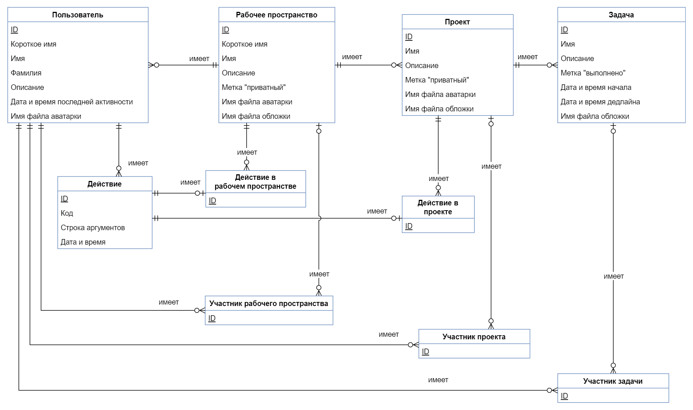
</picture>

## Скриншоты

Ниже представлено три скриншота окон запущенного приложения: 
- Боковая панель
- Окно с задачами рабочего пространства
- Окно создания рабочего пространства

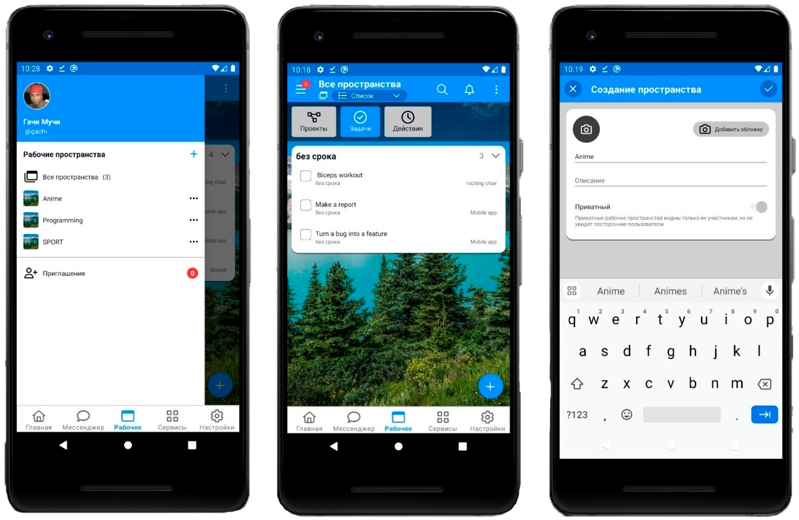
